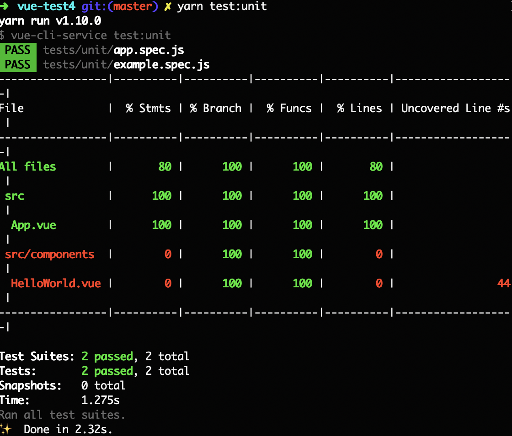

> Demo for https://stackoverflow.com/questions/53249858/how-to-make-test-coverage-show-all-vue-files-in-vue-cli-3-using-jest

*Note: `HelloWorld.vue` intentionally has unused line for demo purposes; and `main.js` is excluded from unit tests because it's a bootstrap file.*
